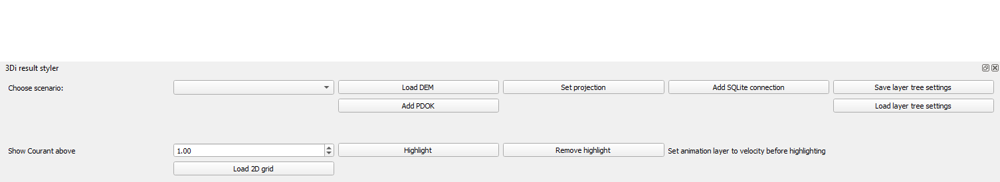
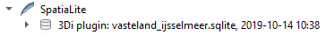
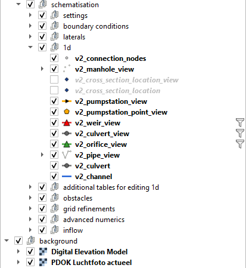
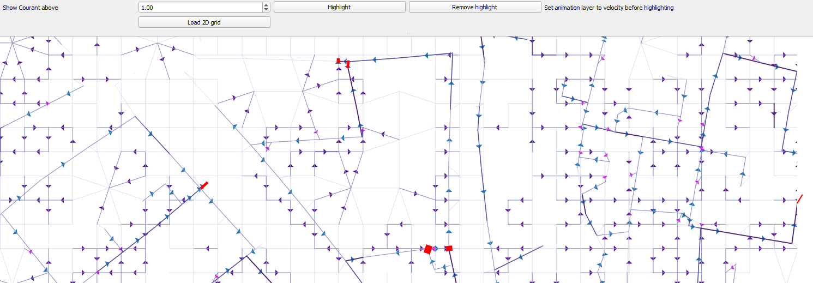
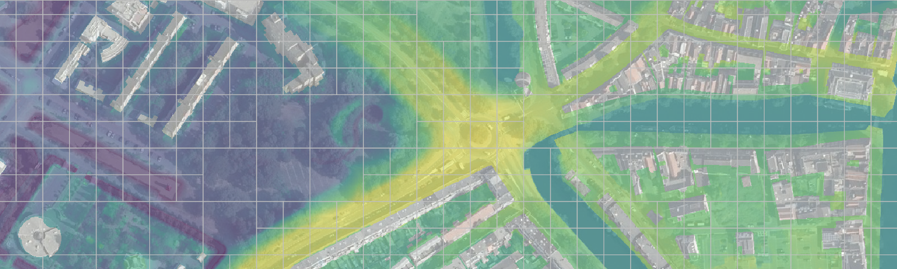

3Di result styler Plugin
==============

A plugin containing beta-tools for working with models and netCDF results from
`3Di`_ hydraulic/hydrologic modelling software.

.. _`3Di`: http://www.3di.nu/

The main features are:

- Automatic load and style the model DEM
- Automatic load and style aerial photographs (PDOK, Netherlands only)
- Set QGIS project CSR to EPSG code supplied in model
- Add loaded 3Di model as a QGIS SpatiaLite connection
- Save and load Layer tree presets containing expanded/collapsed groups and layers, visibility and filters
- Highlight Courant numbers of flowlines above a given threshold for analysis of time step reduction

Before using this tool make sure you have loaded a 3Di model using the 3Di plugin.

Load DEM
---------------
The 'Load DEM'-button will lookup the relative reference to your elevation raster in the 'v2_global_settings' table. The colourmap will be rescaled relative to the view extent and a opacity slider is added in the 'Layers' menu.

.. image:: images/dem_aerial.PNG
.. image:: images/background_slider.PNG

Add PDOK (Netherlands only)
---------------------------
Adds the most recent aerial photo in the PDOK (Publieke Dienstverlening Op Kaart) as a WMTS layer. An opacity slider lets you easily adjust the opacity of this layer.

Set projection
--------------
This function adjusts the QGIS projection based on the projection supplied in the 'v2_global_settings' table.

Add SQLite connection
---------------------
An SpatiaLite connection to the loaded model schematisation (.sqlite file) is made with the name 3Di plugin: <<filename>>, <<YYYY-MM-DD HH:MM>>.
You can use this connection to load additional tables or execute tools from the 3Di toolbox.

Save / Load layer tree settings
-------------------------------
You can save the following settings of the schematisation groups and layers in your layer tree:

- Visibility (layer or group checked or unchecked)
- Expanded or collapsed
- Filter (e.g. show only v2_culverts with a diameter > 0.5m)

These settings will be stored in a JSON file which can be loaded later using the 'Load layer tree settings' button.

Highlight flowlines with a high Courant number
----------------------------------------------
Before using this tool, load a model result and use the animation layers to show the flow velocity on a certain timestep. When you click 'highligh' this tool will highlight any 1D flowline with a Courant number higher than indicated in the toolbar. A higher courant number leads to a thicker highligt.
Flowlines with a high Courant number could lead to timestep-reduction, although this is not stricktly necessary.

Load 2D grid
------------
Before using this tool, load a model result. The 2D calculation grid will be added as a memory layer to the QGIS-project.

